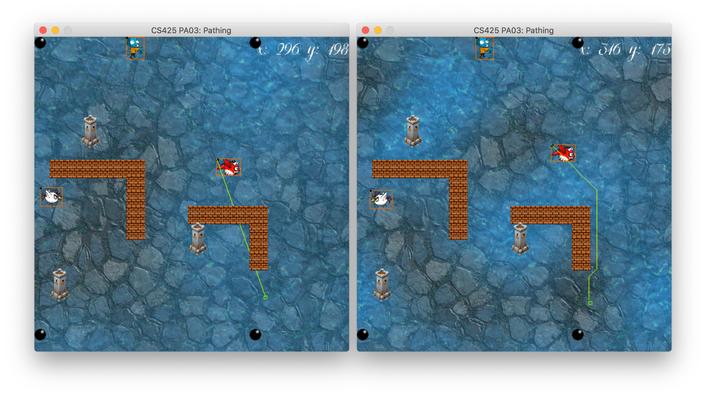

# Programming Assignment 03 : Path Planning
**Due**: Oct 13th, 11:59pm

(Fig 1. Without (left) and with (right) path planning)

## Tasks
0. Compile the code
    - Same as [PA02](../PA02-Perlin-Noise#compile-and-run-the-code). For Windows VC users here is the [solution file](https://www.dropbox.com/s/0mjip5x7zs3a6i6/netid-PA03.zip?dl=0)
1. All tasks are in **MyPathPlanner.cpp/h** (100 pts)
    - Prepare a grid of nodes for searching (20 pts)
        - This grid is the graph that A* will be performed on
    	- We consider 8-connection neighbors here. (N, W, E, S, NE, NW, SE, SW)
     	- A node _n_ has a neighbor node m iff both _m_ and _n_ are free (i.e. no occupied)
     	- Thus, if a node is not free (i.e. occupied), it should not have any neighbors

    - Finish two helper functions to check collision and estimate cost using terrain values (10 pts each)
    	- Strongly suggested to work on these two methods first. 
    	- _Check collision_ can be implemented using the provided helper methods in MyAgent class
    	- _Estimate cost_ is a function that can be implemented in many different ways so use your imagination.
    - Implement A* search (40 pts)
    - Shorten and smooth the path using line segments and Quadratic Bezier curves (20 pts)
    	- See hints in the code

2. Make a video demonstrating your results (0 pts, -5 pts if missing the video) 

## Examples
- [levels/level000.txt](https://www.dropbox.com/s/tnyqmsmm1l0dxio/level000.mov)
  - Double click the set the goal. Clock anywhere to cancel the goal. 
  - Dragon can only move manually using arrow keys when it is not assigned a goal.
  - You might see that the dragon gets caught by the corners of the wall and then stops. This is because I did not check if the connection between two collision-free cells are in fact collision free. You might see something similar in your implementation. 
- [levels/level000.txt](https://www.dropbox.com/s/wpqisfpgojtox7q/level000-terrain.mov) with travel cost estimated from the Perlin noise. 
  - You can see that the dragon would try to avoid the watery part by taking a longer detour.
- [levels/level001.txt](https://www.dropbox.com/s/bi5sgu6jy4z5dvr/level001.mov)

## What to submit

1. Zip the entire folder and the video and name it your_net_id_PA03.zip
2. Upload the zip file to blackboard
3. Please state what Tasks and Bonus Points you have finished on the blackboard submission page. 

